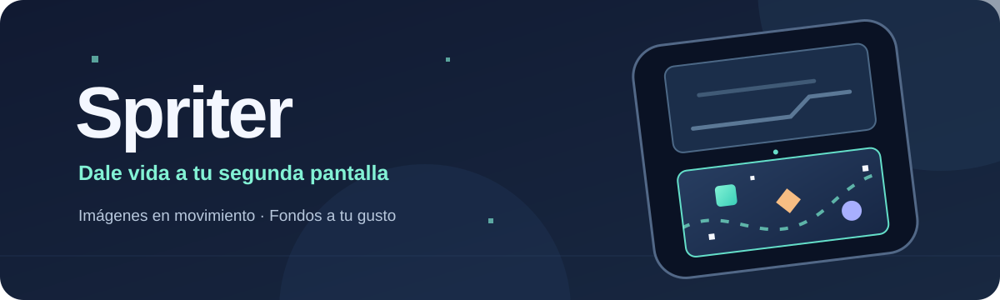

  

# Spriter

**Dale vida a la pantalla libre de tu RG DS.** Spriter muestra imágenes en movimiento mientras juegas o usas otra aplicación en la segunda pantalla. Los personajes aparecen y cambian de forma aleatoria, así que cada sesión se ve diferente.

## Lo que puedes hacer

- Elegir la colección incluida o una carpeta con tus propias imágenes PNG.
- Poner una foto o ilustración como fondo y ajustar su opacidad.
- Cambiar la velocidad de movimiento y el brillo de la ventana.
- Mostrar la hora, la fecha y la batería si lo deseas.
- Mover Spriter a la pantalla libre y abrir un juego en la otra.
- Buscar nuevas versiones desde la aplicación.

Las opciones están en el menú **⋮**. La animación queda visible sin botones sobre ella.

## Descargar y usar

Descarga **Spriter.apk** en [Releases](https://github.com/Riv0Trill224/Spriter/releases) e instálalo en tu RG DS con Android 8.0 o posterior. Abre Spriter y, si aparece en la pantalla equivocada, entra en **⋮ → Pantalla**. Para usar tus imágenes, entra en **⋮ → Colección de sprites → Elegir carpeta externa**. Usa **⋮ → Cerrar** cuando un juego necesite ambas pantallas.

**Actualizaciones:** la app puede avisarte de una nueva versión. Si este repositorio sigue privado, el acceso a los releases requiere un token de GitHub limitado a este repositorio con permiso de lectura de contenido; se configura en **⋮ → Acerca de → Acceso a updates**. También puedes descargar el APK desde Releases e instalarlo manualmente. Los APK de prueba de Actions usan otra firma y no actualizan directamente la versión publicada.

La selección de pantalla depende del comportamiento de Android y de cada juego. El brillo controla la ventana de Spriter; el firmware decide cómo afecta a cada pantalla. Spriter no reconoce automáticamente el nombre del juego o de la ROM.

## Proyecto abierto y créditos

El **código de Spriter, el banner y el icono originales** se ofrecen bajo la [licencia MIT](LICENSE): puedes usarlos, modificarlos y compartirlos conservando el aviso de licencia. Las imágenes de las colecciones incluidas **no forman parte de esa licencia**.

La colección de Pokémon procede de [PokeAPI/sprites](https://github.com/PokeAPI/sprites); sus imágenes pertenecen a The Pokémon Company. Consulta los [créditos y avisos de origen](docs/POKEAPI.md). El paquete personalizado fue aportado al proyecto y su licencia de redistribución independiente no está documentada; no se concede permiso para reutilizarlo por separado. Spriter es un proyecto independiente, sin afiliación con esas marcas.

Si encuentras un fallo o quieres colaborar, abre un [Issue](https://github.com/Riv0Trill224/Spriter/issues). Para detalles de compilación y firma, consulta la carpeta [docs](docs/).
